### 📌

<table width="100%" cellspacing="16" cellpadding="0"><tr><td width="50%" align="center" valign="top"><a href="https://afwct.top"><picture><source media="(prefers-color-scheme: dark)" srcset="./assets/pin-pages-dark.svg"/></picture></a></td><td width="50%" align="center" valign="top"><a href="https://github.com/Afwct/pdf-tool"><picture><source media="(prefers-color-scheme: dark)" srcset="./assets/pin-pdf-tool-dark.svg"/></picture></a></td></tr></table>

<picture>
  <source media="(prefers-color-scheme: dark)" srcset="./assets/divider-dark.svg"/>
  
</picture>

<table width="100%">
<tr>
<td valign="top" width="50%"><picture><source media="(prefers-color-scheme: dark)" srcset="https://readme-typing-svg.demolab.com/?font=Noto+Sans+SC&size=14&center=false&vCenter=true&multiline=false&width=420&height=24&repeat=false&duration=800&pause=250&background=00000000&weight=700&color=2A9E98&lines=%E4%BD%A0%E5%A5%BD%EF%BC%8C%E8%BF%99%E9%87%8C%E6%98%AFAfwct%EF%BC%8C"/></picture><picture><source media="(prefers-color-scheme: dark)" srcset="https://readme-typing-svg.demolab.com/?font=Noto+Sans+SC&size=14&center=false&vCenter=true&multiline=true&width=420&height=140&repeat=false&duration=800&pause=250&background=00000000&weight=500&color=6FCEC8&lines=%E5%86%99%E4%BB%A3%E7%A0%81%E3%80%81%E6%90%AD%E6%9C%8D%E5%8A%A1%E3%80%81%E6%90%8F%E6%B8%B8%E6%88%8F%E3%80%81%E5%81%B6%E5%B0%94%E6%8A%98%E8%85%BE%E8%87%AA%E5%8A%A8%E5%8C%96%EF%BC%8C%3B%E8%83%BD%E8%84%9A%E6%9C%AC%E5%8C%96%E7%9A%84%E7%BB%9D%E4%B8%8D%E6%89%8B%E7%82%B9%EF%BC%8C%3BGitHub%20%E4%B8%8A%E9%9A%8F%E7%BC%98%E6%8F%90%E4%BA%A4%EF%BC%8C%E5%B8%8C%E6%9C%9B%E6%85%A2%E6%85%A2%E6%8A%8A%E6%8A%80%E8%83%BD%E6%A0%91%E7%82%B9%E6%BB%A1%E3%80%82%3B%20%3B%E5%A6%82%E6%9E%9C%E4%BD%A0%E4%B9%9F%E5%96%9C%E6%AC%A2%E4%B8%96%E7%95%8C%E7%AC%AC%E4%B8%80%E5%85%AC%E4%B8%BB%E6%AE%BF%E4%B8%8B%EF%BC%8C%E9%82%A3%E4%B9%88%E6%88%91%E4%BB%AC%E4%B8%80%E5%AE%9A%E4%BC%9A%E6%88%90%E4%B8%BA%E5%A5%BD%E6%9C%8B%E5%8F%8B%E7%9A%84%EF%BC%81"/></picture></td>
<td valign="top" width="50%" align="center"><picture><source media="(prefers-color-scheme: dark)" srcset="./assets/stats-dark.svg"/></picture></td>
</tr>
<tr>
<td colspan="2" align="center"><picture><source media="(prefers-color-scheme: dark)" srcset="./assets/snake-dark.svg"/><source media="(prefers-reduced-motion: no-preference)" srcset="./assets/snake.svg"/></picture></td>
</tr>
</table>

<picture>
  <source media="(prefers-color-scheme: dark)" srcset="./assets/divider-dark.svg"/>
  
</picture>

### 🛠️

<picture>
  <source media="(prefers-color-scheme: dark)" srcset="./assets/divider-dark.svg"/>
  
</picture>

<picture>
  <source media="(prefers-color-scheme: dark)" srcset="./assets/top-langs-dark.svg"/>
  
</picture>

<picture>
  <source media="(prefers-color-scheme: dark)" srcset="./assets/divider-dark.svg"/>
  
</picture>

Crafted with  by <a href="https://github.com/Afwct"><strong>Afwct</strong></a>

